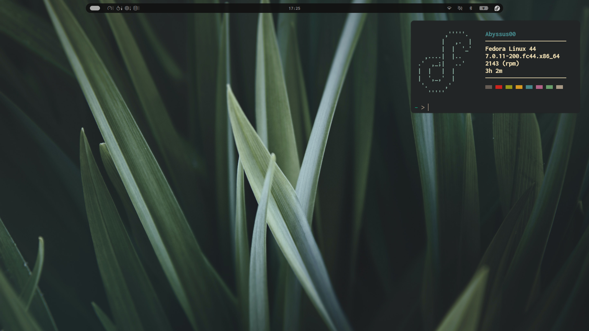
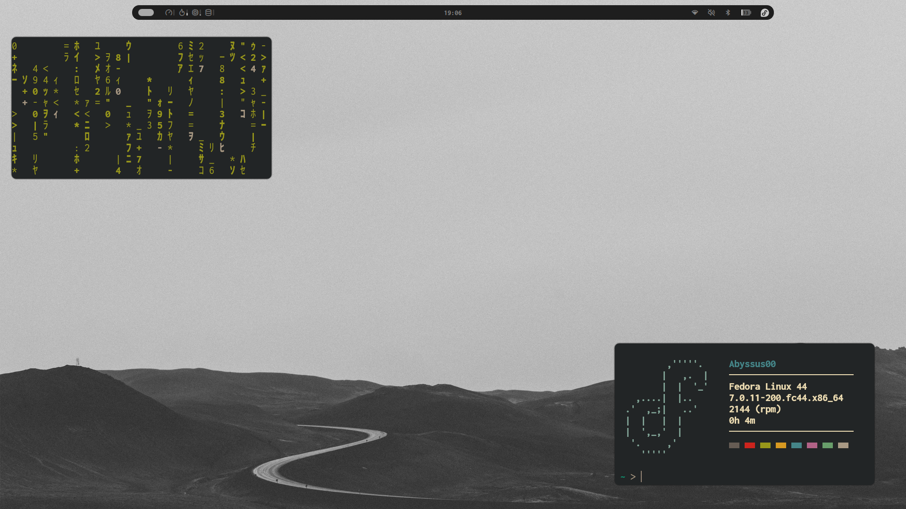
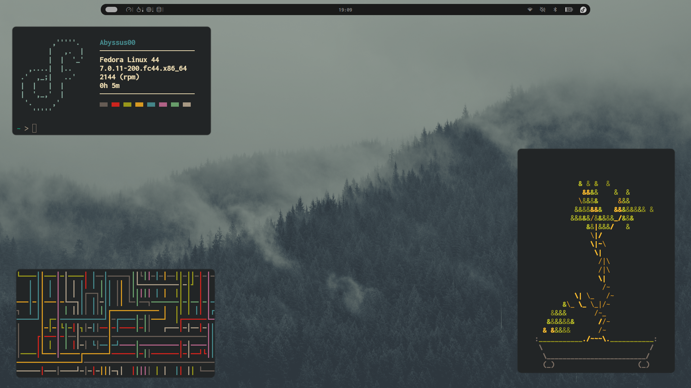

# Hyprland-dotfiles

Repositorio de configuraciones personales para el compositor de ventanas Hyprland, meticulosamente optimizadas y adaptadas para la arquitectura y el rendimiento de la laptop Huawei MateBook D16 bajo el sistema operativo Fedora Linux.

Este entorno ha sido diseñado con el propósito de consolidar un espacio de trabajo de alto rendimiento, fluido y visualmente cohesivo dentro del ecosistema nativo de Wayland. El núcleo de esta personalización integra una configuración modular de Noctalia Shell como interfaz y panel principal del sistema, el emulador de terminal Kitty optimizado para una respuesta inmediata mediante aceleración por GPU, y el lanzador dinámico Rofi adaptado estéticamente para una navegación ágil y sin fricciones.

El resultado es un sistema minimalista, eficiente en el consumo de recursos y adaptado al hardware diario. ¡Siéntete libre de explorar el código, clonar el repositorio y adaptar estas configuraciones a tu propio flujo de trabajo!

``` 
                                                                     ,'''''.
                                                                    |   ,.  |
                         ______         __                	        |  |  '_'
                        / ____/__  ____/ /___  _________ _     ,....|  |..
                       / /_  / _ \/ __  / __ \/ ___/ __ `/   .'  ,_;|   ..'
                      / __/ /  __/ /_/ / /_/ / /  / /_/ /    |  |   |  |
                     /_/    \___/\__,_/\____/_/   \__,_/     |  ',_,'  |
                                                        	  '.     ,'
                                                                '''''
```

## Especificaciones

Este entorno ha sido meticulosamente adaptado para el hardware de la laptop y requiere de ciertos paquetes clave en Fedora Linux para el correcto funcionamiento de todos sus scripts:

* **Laptop:** Huawei MateBook D16
* **S.O.:** Fedora Linux
* **Entorno/Compositor:** `hyprland` (Entorno base nativo en Wayland)
* **Panel, Interfaz y Fondos:** Noctalia Shell (Gestiona de forma nativa la barra de estado, los menús y el cambio de fondos de pantalla)
* **Terminal:** `kitty` (Configurada con soporte de aceleración por GPU)
* **Lanzador de Apps:** `rofi-wayland` (Adaptado sin fricciones para Wayland)
* **Audio y Multimedia:** `wireplumber` (`wpctl`) y `playerctl` (Para la gestión de flujos de audio y control de reproducción)
* **Brillo de Pantalla:** `brightnessctl` (Esencial para controlar la retroiluminación nativa del panel de la MateBook D16)
* **Control de Red:** `NetworkManager` (`nmcli` integrado para los toggles rápidos de activación/desactivación de WiFi)

## Estructura del Proyecto

```
HYPRLAND-FEDORA/
├── .config/
│   ├── fastfetch/
│   │   └── config.jsonc      # Configuración del sistema y visualización de info
│   ├── hypr/
│   │   └── hyprland.conf     # Configuraciones del compositor, atajos y ventanas
│   ├── kitty/
│   │   └── kitty.conf        # Atajos, fuentes y tema de la terminal acelerada por GPU
│   ├── neofetch/
│   │   └── config.conf       # Customización clásica del fetch del sistema
│   ├── noctalia/
│   │   └── noctalia.conf     # Módulos, barras y paneles del shell principal
│   ├── nvim/
│   │   └── gruvbox.lua       # Configuración principal para el tema de nvim "Gruvbox"
│   └── rofi/
│       └── config.rasi       # Tema estético y comportamiento del lanzador
├── assets/
│   ├── Desktop1.png         
│   ├── Desktop2.png          
│   └── Desktop3.png         
├── zsh/
│   └── .zshrc                # Aliases, funciones y personalización de la Shell
├── README.md                 # 
└── Yuki.jpeg                 # Imagen de usuario personal
```

## Capturas




## Atajos de Teclado (`$mainMod` = Tecla SUPER / Windows)

### Gestión de Sistema y Aplicaciones
| Combinación | Acción |
| :--- | :--- |
| `SUPER + RETURN` | Abrir emulador de terminal (**Kitty**) |
| `SUPER + F` | Abrir navegador web (**Firefox**) |
| `SUPER + E` | Abrir gestor de archivos de GNOME (**Nautilus**) |
| `SUPER + R` | Lanzar el menú dinámico de aplicaciones (**Rofi**) |
| `SUPER + I` | Abrir panel de control del sistema (**Hyprsettings**) |
| `SUPER + Q` | Cerrar la ventana que se encuentra activa |
| `SUPER + L` | Alternar el modo de pantalla completa |
| `SUPER + M` | Forzar la salida de la sesión actual de Hyprland |

### Scripts y Herramientas Propias
| Combinación | Acción |
| :--- | :--- |
| `SUPER + V` | Lanzar script de personalización para ventanas flotantes |
| `SUPER + O` | Ejecutar script propio de opacidad dinámica |
| `SUPER + B` | Apagar la tarjeta de red WiFi mediante comandos `nmcli` |
| `SUPER + N` | Encender la tarjeta de red WiFi mediante comandos `nmcli` |
| `SUPER + C` | Mostrar/Ocultar el espacio de trabajo reservado (**Special Workspace / Magic**) |

### Navegación y Control Multimedia
| Acción / Componente | Combinación de Teclas |
| :--- | :--- |
| **Cambiar foco entre ventanas** | `SUPER + [Flecha Izquierda / Derecha / Arriba / Abajo]` |
| **Moverse entre Escritorios (1 al 10)** | `SUPER + [Teclas 1 al 0]` |
| **Enviar ventana a otro Escritorio** | `SUPER + SHIFT + [Teclas 1 al 0]` |
| **Mover o redimensionar ventanas** | `SUPER + Mouse (Click Izquierdo / Click Derecho)` |
| **Control de volumen global** | Teclas multimedia de audio vinculadas a `wpctl` |
| **Control de brillo de pantalla** | Teclas multimedia de brillo vinculadas a `brightnessctl` |
| **Control de reproducción** | Teclas multimedia (`Next`, `Pause`, `Play`, `Prev`) vinculadas a `playerctl` |

> Puedes alternar de forma instantánea la distribución de tu teclado entre español (`es`) e inglés (`us`) presionando la combinación `SUPER + ESPACIO`.

## Instalación Rápida

## 🚀 Instalación Rápida


### 1. Clonar este repositorio
```bash
git clone [https://github.com/Abyssus4973160/Hyprland-Fedora.git](https://github.com/Abyssus4973160/Hyprland-Fedora.git)
cd Hyprland-Fedora
```

### 2. Instalacion de Noctalia Shell
Para instalar el núcleo visual de este setup, utilizaremos el repositorio COPR oficial de Noctalia para Fedora:
```bash
sudo dnf copr enable noctalia/shell
sudo dnf install noctalia-shell
```

### 3. Instalar dependencias adicionales del sistema
Instala el resto de las herramientas necesarias para que el compositor, la terminal y los scripts multimedia funcionen correctamente:
```bash
sudo dnf install hyprland kitty rofi-wayland brightnessctl playerctl wireplumber nautilus zsh neovim fastfetch
```

### 4. Desplegar los Archivos de Configuración (Dotfiles)
Mueve las carpetas de personalización a sus rutas correspondientes en tu directorio nativo:
```bash
# Copiar todas las configuraciones de aplicaciones a ~/.config
cp -r .config/* ~/.config/

# Configurar la shell Zsh
cp zsh/.zshrc ~/

# Mover recursos adicionales
cp Yuki.jpeg ~/Pictures/
```