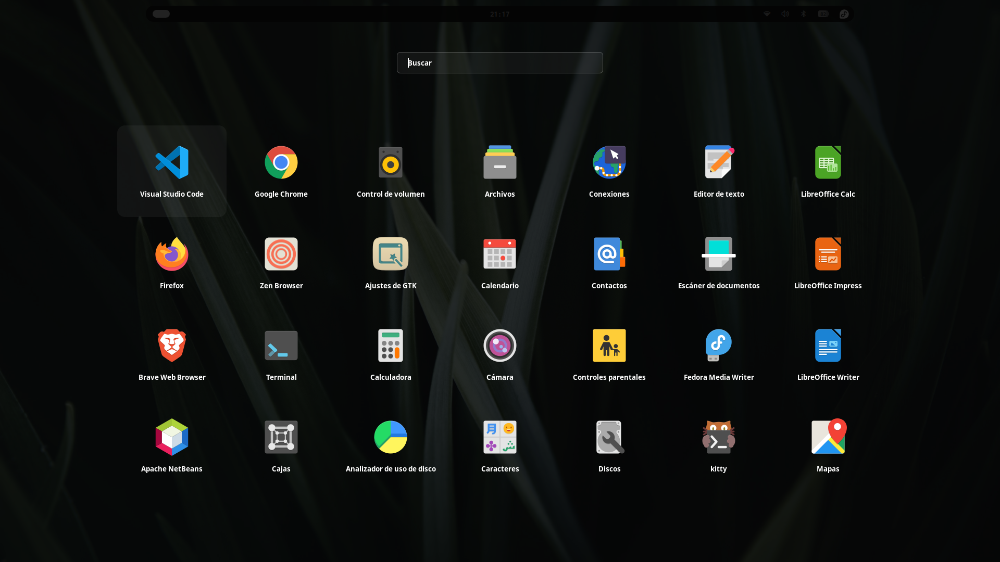
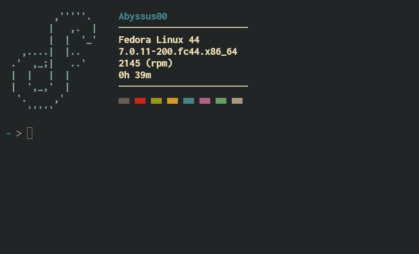
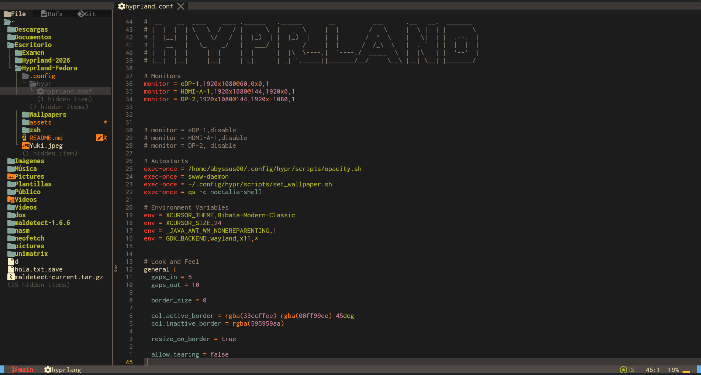

``` 
                                                                      ,'''''.
                                                                     |   ,.  |
                          ______         __                	         |  |  '_'
                         / ____/__  ____/ /___  _________ _     ,....|  |..
                        / /_  / _ \/ __  / __ \/ ___/ __ `/   .'  ,_;|   ..'
                       / __/ /  __/ /_/ / /_/ / /  / /_/ /    |  |   |  |
                      /_/    \___/\__,_/\____/_/   \__,_/     |  ',_,'  |
                                                               '.     ,'
                                                                 '''''
```
<div align="center">

# Hyprland Dotfiles — Fedora Linux
Repositorio de configuraciones personales para el compositor de ventanas Hyprland, meticulosamente optimizadas y adaptadas para la arquitectura y el rendimiento de la laptop Huawei MateBook D16 bajo el sistema operativo Fedora Linux.

Este entorno ha sido diseñado con el propósito de consolidar un espacio de trabajo de alto rendimiento, fluido y visualmente cohesivo dentro del ecosistema nativo de Wayland. El núcleo de esta personalización integra una configuración modular de Noctalia Shell como interfaz y panel principal del sistema, el emulador de terminal Kitty optimizado para una respuesta inmediata mediante aceleración por GPU, y el lanzador dinámico Rofi adaptado estéticamente para una navegación ágil y sin fricciones.

El resultado es un sistema minimalista, eficiente en el consumo de recursos y adaptado al hardware diario.


</div>

---

<div align="center">

## Vista previa

</div>
 
<p align="center">
  <br><br>
  <br><br>
  
</p>
<details>
<summary>Ver más capturas</summary>
<br>
<p align="center">
  <b>Rofi</b><br>
  <br><br>
  <b>Kitty — Fastfetch / Neofetch</b><br>
  <br><br>
  <b>AstroNvim — Gruvbox</b><br>
  
</p>
</details>

---


## Especificaciones de hardware
 
- **Laptop:** Huawei MateBook D16
- **Sistema operativo:** Fedora Linux
- **Arquitectura:** x86\_64

---

## Stack principal
 
| Componente | Herramienta | Descripción |
| :--- | :--- | :--- |
| **Compositor** | `hyprland` | Entorno base nativo en Wayland |
| **Panel / Shell** | `noctalia-shell` | Barra de estado, menús y cambio de fondos |
| **Terminal** | `kitty` | Aceleración por GPU para respuesta inmediata |
| **Lanzador** | `rofi-wayland` | Navegación ágil y sin fricciones en Wayland |
| **Editor** | `neovim` + AstroNvim | Entorno de edición extensible con tema Gruvbox |
| **Audio** | `wireplumber` / `wpctl` | Gestión de flujos de audio |
| **Multimedia** | `playerctl` | Control de reproducción |
| **Brillo** | `brightnessctl` | Retroiluminación nativa del panel |
| **Red** | `NetworkManager` / `nmcli` | Toggles rápidos de WiFi |
| **Shell** | `zsh` | Con aliases, funciones y personalización propia |

---

## Paleta de colores

### Kitty — Terminal (Gruvbox Dark)

| Color | Hex | Uso |
| :---: | :--- | :--- |
|  | `#222526` | Fondo |
|  | `#ebdbb2` | Texto principal |
|  | `#928374` | Cursor |
|  | `#cc241d` | Rojo |
|  | `#98971a` | Verde |
|  | `#d79921` | Amarillo |
|  | `#458588` | Azul |
|  | `#b16286` | Morado |
|  | `#689d6a` | Aqua |

### Cava — Gradiente

       

### Neovim — Gruvbox

| Color | Hex | Uso |
| :---: | :--- | :--- |
|  | `#282828` | Fondo |
|  | `#ebdbb2` | Texto principal |
|  | `#fabd2f` | Amarillo |
|  | `#b8bb26` | Verde |
|  | `#fb4934` | Rojo |
|  | `#83a598` | Azul |

---


## Estructura del Proyecto

```
HYPRLAND-FEDORA/
├── .config/
│   ├── fastfetch/
│   │   └── config.jsonc      # Configuración del sistema y visualización de info
│   ├── hypr/
│   │   └── hyprland.conf     # Configuraciones del compositor, atajos y ventanas
│   ├── kitty/
│   │   └── kitty.conf        # Atajos, fuentes y tema de la terminal acelerada por GPU
│   ├── neofetch/
│   │   └── config.conf       # Customización clásica del fetch del sistema
│   ├── noctalia/
│   ├── nvim(Gruvbox)/
│   │   └── gruvbox.lua       # Plugin para el tema Gruvbox de nvim
│   ├── cava/
│   │   └── config            # Configuracion de colores
│   └── rofi/
│       ├── config.rasi       # Configuracion del lanzador
│       ├── launcher.rasi     # Archivo de seleccion de tema
│       └── style-3.rasi      # Apariencia del lanzador
├── assets/       
├── Wallpapers/
│   ├── Blue.png
│   ├── Gray.jpg
│   └── Green.jpg
├── zsh/
│   └── .zshrc                # Aliases, funciones y personalización de la Shell
├── README.md                 
└── Yuki.jpeg                 # Imagen de usuario personal
```

## Atajos de Teclado (`$mainMod` = Tecla SUPER / Windows)

### Gestión de Sistema y Aplicaciones
| Combinación | Acción |
| :--- | :--- |
| `SUPER + RETURN` | Abrir emulador de terminal (**Kitty**) |
| `SUPER + F` | Abrir navegador web (**Firefox**) |
| `SUPER + E` | Abrir gestor de archivos de GNOME (**Nautilus**) |
| `SUPER + R` | Lanzar el menú dinámico de aplicaciones (**Rofi**) |
| `SUPER + I` | Abrir panel de control del sistema (**Hyprsettings**) |
| `SUPER + Q` | Cerrar la ventana que se encuentra activa |
| `SUPER + L` | Alternar el modo de pantalla completa |
| `SUPER + M` | Forzar la salida de la sesión actual de Hyprland |

### Scripts y Herramientas Propias
| Combinación | Acción |
| :--- | :--- |
| `SUPER + V` | Lanzar script de personalización para ventanas flotantes |
| `SUPER + O` | Ejecutar script propio de opacidad dinámica |
| `SUPER + B` | Apagar la tarjeta de red WiFi mediante comandos `nmcli` |
| `SUPER + N` | Encender la tarjeta de red WiFi mediante comandos `nmcli` |
| `SUPER + C` | Mostrar/Ocultar el espacio de trabajo reservado (**Special Workspace / Magic**) |

### Navegación y Control Multimedia
| Acción / Componente | Combinación de Teclas |
| :--- | :--- |
| **Cambiar foco entre ventanas** | `SUPER + [Flecha Izquierda / Derecha / Arriba / Abajo]` |
| **Moverse entre Escritorios (1 al 10)** | `SUPER + [Teclas 1 al 0]` |
| **Enviar ventana a otro Escritorio** | `SUPER + SHIFT + [Teclas 1 al 0]` |
| **Mover o redimensionar ventanas** | `SUPER + Mouse (Click Izquierdo / Click Derecho)` |
| **Control de volumen global** | Teclas multimedia de audio vinculadas a `wpctl` |
| **Control de brillo de pantalla** | Teclas multimedia de brillo vinculadas a `brightnessctl` |
| **Control de reproducción** | Teclas multimedia (`Next`, `Pause`, `Play`, `Prev`) vinculadas a `playerctl` |

> Se puede alternar de forma instantánea la distribución de tu teclado entre español (`es`) e inglés (`us`) presionando la combinación `SUPER + ESPACIO`.

## Instalación Rápida

### 1. Clonar este repositorio
```bash
git clone [https://github.com/Abyssus4973160/Hyprland-Fedora.git](https://github.com/Abyssus4973160/Hyprland-Fedora.git)
cd Hyprland-Fedora
```

### 2. Habilitar e Instalar Hyprland (Versión Actualizada)
Para obtener la última versión del compositor optimizada para Fedora, habilitamos el repositorio COPR de solopasha antes de instalar:
```bash
sudo dnf copr enable solopasha/hyprland
sudo dnf install hyprland
```

### 3. Instalacion de Noctalia Shell
Para instalar el núcleo visual de este setup, utilizaremos el repositorio COPR oficial de Noctalia para Fedora:
```bash
sudo dnf copr enable noctalia/shell
sudo dnf install noctalia-shell
```

### 4. Instalar dependencias adicionales del sistema
Instala el resto de las herramientas necesarias para que el compositor, la terminal y los scripts multimedia funcionen correctamente:
```bash
sudo dnf install hyprland kitty rofi-wayland brightnessctl playerctl wireplumber nautilus zsh neovim fastfetch
```

### 5. Instalar AstroNvim y sus dependencias de sistema
Ejecuta el siguiente bloque de comandos para configurar las herramientas y la base de AstroNvim:
```bash
# Instalar utilidades requeridas por AstroNvim
sudo dnf install wl-clipboard ripgrep -y

# Habilitar repositorio e instalar lazygit
sudo dnf copr enable atim/lazygit -y
sudo dnf check-update
sudo dnf install lazygit -y

# Instalar gdu (analizador de disco rápido)
curl -L [https://github.com/dundee/gdu/releases/latest/download/gdu_linux_amd64.tgz](https://github.com/dundee/gdu/releases/latest/download/gdu_linux_amd64.tgz) | tar xz
chmod +x gdu_linux_amd64
sudo mv gdu_linux_amd64 /usr/bin/gdu

# Instalar parsers y herramientas mediante cargo binstall (requiere tener Rust instalado)
cargo binstall tree-sitter-cli bottom

# Descargar la plantilla de configuración base de AstroNvim
git clone --depth 1 [https://github.com/AstroNvim/template](https://github.com/AstroNvim/template) ~/.config/nvim
rm -rf ~/.config/nvim/.git

# Iniciar Neovim para que se autoinstalen los plugins y temas
nvim
```

### 6. Desplegar los Archivos de Configuración (Dotfiles)
Mueve las carpetas de personalización a sus rutas correspondientes en tu directorio nativo:
```bash
# Copiar todas las configuraciones de aplicaciones a ~/.config
cp -r .config/* ~/.config/

# Mover el tema Gruvbox a la ruta de plugins de AstroNvim
cp "~/.config/nvim(Gruvbox)/gruvbox.lua" ~/.config/nvim/lua/plugins/

# Configurar la shell Zsh
cp zsh/.zshrc ~/

# Mover recursos adicionales
cp Yuki.jpeg ~/Pictures/
```

